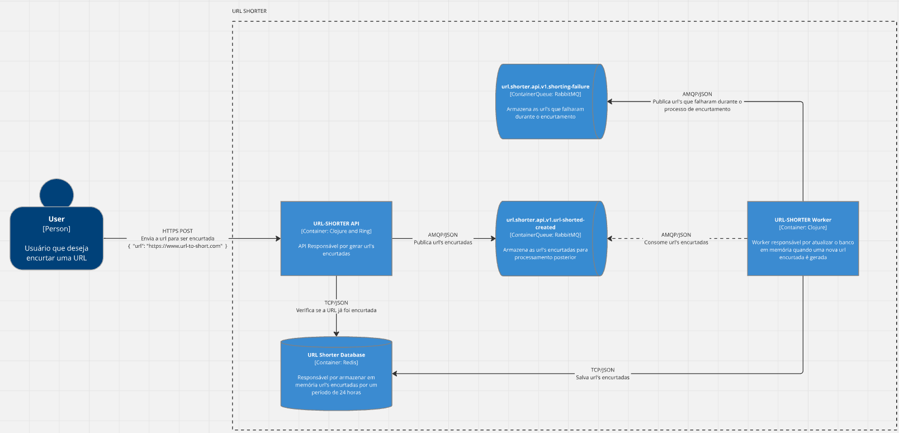

# url-shorter

API REST para encurtar URL'S com um tempo de expiração de 24 horas.

## Arquitetura



## Run

```docker
docker compose -f docker-compose.yml -p url-shorter up -d
```

## Down

```docker
docker compose -f docker-compose.yml -p url-shorter down
```

## Encurtando URL

```curl
curl --location 'http://host:8080/urls/short-url' \
--header 'Content-Type: application/json' \
--data '{
    "url": "https://www.url-to-short.com"
}'
```

Respostas:

- 200 ➜ url encurtada com sucesso
- 409 ➜ url já encurtada
- 400 ➜ url para ser encurtada inválida
- 500 ➜ Erro interno no servidor
